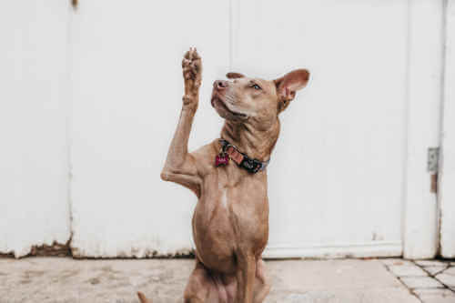

---

title: Búsqueda de respuestas con IA en 3 simples pasos 
tags:
 - NPL
 - Machine Learning 
 - IA
 - Prototipos
date: 2023-02-10
template: post
description: Tratando de buscar alternativas a ChatGPT me encontré con Hugging Face 🤗 una herramienta que baja modelos pre-entrenados de Procesamiento de Lenguaje Natural (NPL) 

---



Lo que vamos a hacer es dar una definición y después hacer una simple pregunta, esto se conoce como [Búsqueda de respuestas](https://huggingface.co/tasks/question-answering).

## Primer paso

Instalar [PyTorch](https://pytorch.org/), en Linux y Windows, es tan simple como correr:

```
pip3 install torch torchvision torchaudio --extra-index-url https://download.pytorch.org/whl/cu116
```

## Segundo paso

Instalar [transformers](https://huggingface.co/docs/transformers/installation)

```
pip3 install transformers
```

## Tercer paso

Ejecutar el siguiente script en Python

```
from transformers import pipeline

# Este modelo esta en español
model = "timpal0l/mdeberta-v3-base-squad2"

nlp = pipeline('question-answering', model=model, tokenizer=model)
qa = {
    'context': 'Me llamo Rodrigo y me dicen Albo.',
    'question': 'Cual es mi nombre?' 
}
res = nlp(qa)
print(res)
```

El modelo se va a bajar automágicamente y se va a ejecutar. Una vez que lo haga, usamos el [pipeline de question-answering](https://huggingface.co/docs/transformers/tasks/question_answering#inference) y vas a recibir una respuesta como esta:

```
{'score': 0.8922366499900818, 'start': 8, 'end': 16, 'answer': ' Rodrigo'}
```

El score es el puntaje que le asigna el modelo a la respuesta, un número entre el 0 y 1 siendo 1 lo mas cerca posible. Lo podemos usar para saber el grado de certeza que tenemos de que esa respuesta sea correcta.

No me sorprendé para nada las capacidades del procesamiento de lenguaje, si estoy muy sorprendido con los pocos pasos que se necesitan para hacer un prototipo. Ahora es su turno, ¡pruebenlo ustedes mismos!


*La foto es de [Camylla Battani](https://unsplash.com/es/@camylla93?utm_source=unsplash&utm_medium=referral&utm_content=creditCopyText) publicada en [Unsplash](https://unsplash.com/?utm_source=unsplash&utm_medium=referral&utm_content=creditCopyText)*
