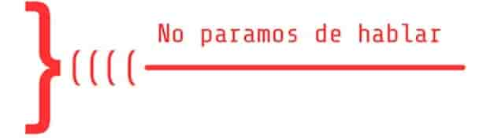

---

title: "NPdH Capítulo 1:  Un podcast para los que empiezan el mundo de sistemas"
tags:
 - podcast
 - no-paramos-de-hablar
date: 2021-08-20
last_update: 2021-11-30
template: post
description: Primer episodio de No paramos de hablar, un podcast para los que aprenden a programar.

---

Con [Flor Castro](https://twitter.com/florencia020504) coincidimos en

1. El lugar de trabajo
2. Nos gusta programar
3. Nos gusta enseñar o acompañar a la gente con poca experiencia
4. Hablamos mucho. Mucho en serio.

Lo más lógico era armar un podcast, asi que aca esta **[No paramos de hablar](https://www.youtube.com/channel/UCFKVoPT-WVK0rgFm0Qdy0kg)** un podcast para los que empiezan a programar.

En este primer capítulo nos presentamos y contamos un poco que hacemos (¡y que no!) en nuestro trabajo.

Podes [verlo en Youtube](https://www.youtube.com/watch?v=0Ovh45uBgbc) o [escucharlo en Spotify](https://open.spotify.com/episode/6qm2mvW2pD1X7ktl2Nin6p).

