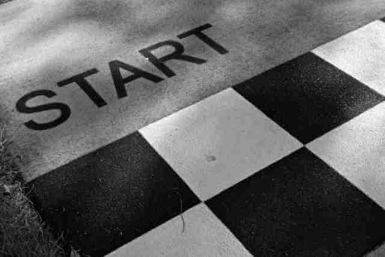

---

title: ¿Por donde empiezo? 
tags:
 - Tips para Juniors 
 - Programacion 
date: 2022-11-25
template: post
description: Quiero aprender a programar, ¿qué tengo que hacer? 

---



Bien, ya [tengo una computadora e Internet](que-necesito-para-programar.html) ahora tenes que aplicar la siguiente receta.

```
Repetir hasta que sepas programar. 
  
  Buscar en Google que queres aprender a programar.

  Para cada uno de los primeros 3 resultados:
  
    Entrar a leer el contenido.
    
    Si tiene ejercicios para hacer:
      
      Hacer los ejercicios.

  Si pude poner en práctica lo que aprendí de programar:
    
    ¡Listo! ¡Ya sabes programar!
  
  Si no:
    
    Cambio la búsqueda agregando  y modificando palabras que 
    fui conociendo con lo que vi hasta ahora.

Volvé al principio.
```

Ni siquiera tenes que hacerlo en Google (aunque lo recomiendo mucho), podés buscar en YouTube, en TikTok, cualquier plataforma que tenga un buscador y contenidos. Si hasta TikTok.

Antes de seguir, anda a buscar lo primero que se te ocurra.

¿Volviste ya? No en serio, anda a buscar.

Bueno esta bien, aca tenes unos ejemplos:

* [Aprender a programar](https://www.google.com/search?q=aprender+a+programar) en Google
* [Que es programar](https://www.google.com/search?q=que+es+programar) en Google
* [Que es programar](https://www.youtube.com/results?search_query=que+es+programar) en YouTube
* [Aprender a programar](https://www.tiktok.com/search?q=aprender%20a%20programar) en TikTok
* [quiero aprender a programar desde cero](https://www.youtube.com/results?search_query=quiero+aprender+a+programar+desde+cero) en YouTube
* [Curso gratis para aprender a programar](https://www.google.com/search?q=curso+gratis+para+aprender+a+programar) en Google

No trates de buscar el mejor lugar, empeza por cualquiera y si no te gusta pasate a otro.

**Acordate que es muy importante que practiques.** No se trata solo de leer o mirar. Y esta muy bien copiar y pegar código, pero intenta escribirlo por tu cuenta, equivocate.

Bueno para que te des una idea, programar se trata de escribir algo parecido a esa recetas, de una manera determinada que nos entienda. Las recetas se llaman [algoritmos](https://es.wikipedia.org/wiki/Algoritmo) y cuando estan escritas en un lenguaje que puedan procesar las computadoras (o se puedan convertir en un lenguaje que ellas entiendan) le decimos código.

Les recomiendo a todos empezar por aca. Buscando información por su cuenta, sin tener mucha idea de que camino seguir. Elijan un camino y equivoquense. No es que sea la manera mas eficiente de aprender, es que es la manera que trabajamos día a día. Si, por supuesto que pueden pedir ayuda, también nosotros lo hacemos. Pero primero traten un poco por su cuenta.

Por último, **no inviertan dinero** antes de saber que les gusta o no programar. Hay muchos recursos gratis.

*La foto es de [Siggy Nowak](https://pixabay.com/users/memorycatcher-168384/?utm_source=link-attribution&amp;utm_medium=referral&amp;utm_campaign=image&amp;utm_content=1414148) publicada en [Pixabay](https://pixabay.com/users/memorycatcher-168384/?utm_source=link-attribution&amp;utm_medium=referral&amp;utm_campaign=image&amp;utm_content=1414148)*
