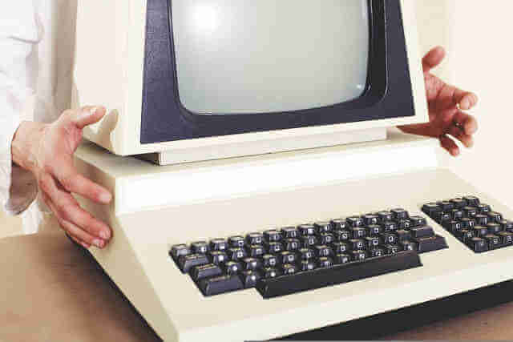

---

title: ¿Qué necesito para programar? 
tags:
 - Tips para Juniors 
 - Programacion 
date: 2022-10-04
template: post
description: Para programar solo necesitas una computadora, internet y tiempo. 

---

## Computadora

Cualquier computadora sirve. Se puede programar en cualquier sistema operativo (Windows, Mac, distribuciones basadas en Linux, etc). Puede ser de escritorio o notebook. Para compilar mas rápido es mejor tener mas procesador o mas cores (núcleos) y mas RAM te permite tener mas programas abiertos al mismo tiempo. Si tendría que priorizar un componente sería un disco SSD.

## Internet

Antes de internet la gente programaba. Para eso usaba revistas y/o libros como documentación. Hoy esta todo en Google, y en [StackOverflow](https://stackoverflow.com). Hay maneras de bajar la documentación, como [la app Zeal](https://zealdocs.org/) y también [DevDocs, desde el browser](https://devdocs.io/), pero esto le sirve mas a un programador mas avanzado (aunque es una buena práctica que te [acostumbres a leer la documentación](https://es.wikipedia.org/wiki/RTFM)).

## Tiempo

Necesitas tiempo para hacer un curso, para ver un video, para leer un libro, cualquiera sea el método que elegiste para aprender. Y mucho, muy importante, necesitas sentarte y programar. Aunque sea un algo tan sencillo como un ["Hola Mundo"](https://es.wikipedia.org/wiki/Hola_mundo).

¿Cuanto tiempo necesitás para aprender? Según el libro *Outliers. The story of success* de [Malcolm Gladwell](https://es.wikipedia.org/wiki/Malcolm_Gladwell) 

* **1 hora:** Se puede saber lo básico, pero rara vez sirve para algo. Se necesita un mayor grado de aprendizaje.
* **10 horas:** Se tiene una mejor noción pero sigue siendo básico.
* **100 horas**: Un curso medio tiene esta carga horaria, ya podés desenvolverte, podés conseguir trabajo pero te va a costar ya que hay muchos en esta situación
* **1.000 horas**: Ya tenés muchas herramientas para conseguir trabajo o ya estás trabajando. 
* **10.000 horas**: estás cerca de ser un experto 

Como bien dice [este artículo sobre la regla de las 10.000 horas](https://www.psicoactiva.com/blog/la-regla-las-10-000-horas-exito/), ser un experto no te convierte en el mejor de todos, pero difícilmente llegues a ser el mejor de todos sin esas cantidad de horas.

**¡A seguir practicando!**

*La foto es de [andreas160578](https://pixabay.com/users/andreas160578-2383079/?utm_source=link-attribution&amp;utm_medium=referral&amp;utm_campaign=image&amp;utm_content=1895383) publicada en [Pixabay](https://pixabay.com//?utm_source=link-attribution&amp;utm_medium=referral&amp;utm_campaign=image&amp;utm_content=1895383)*

